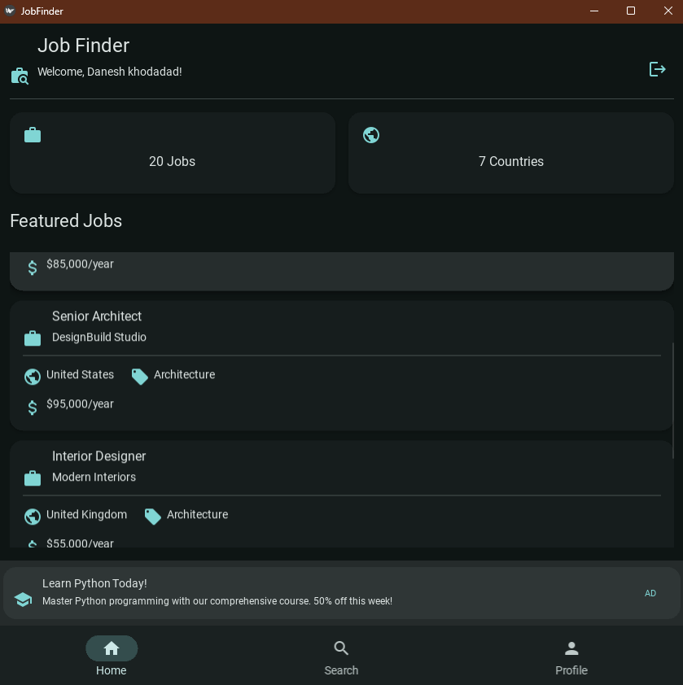
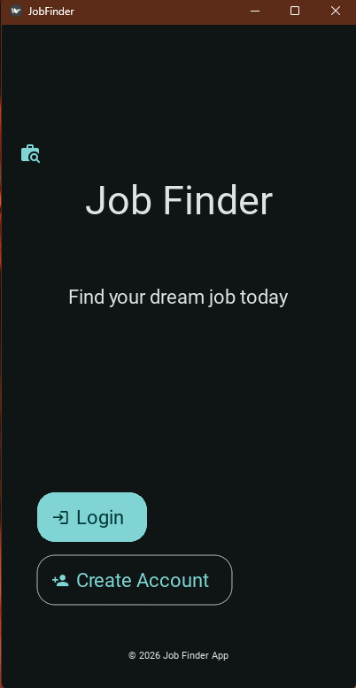
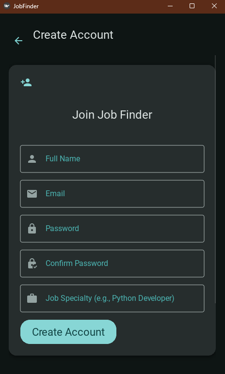
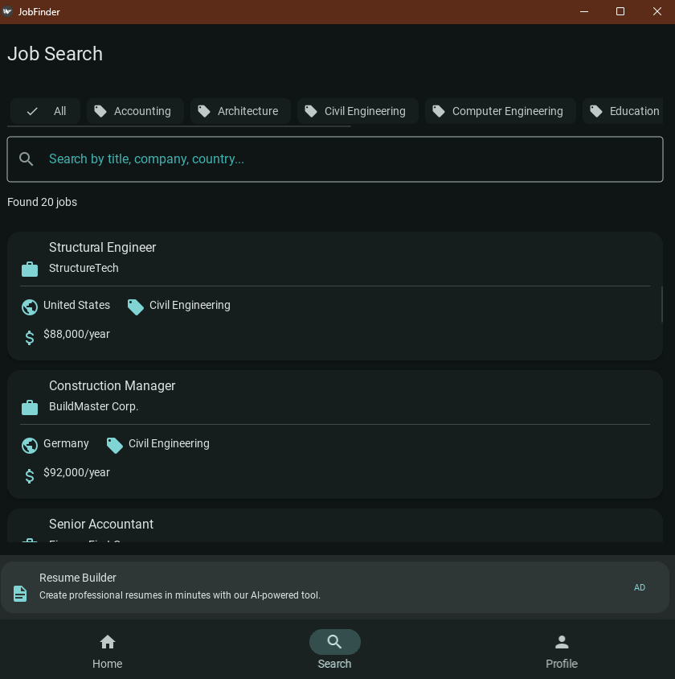
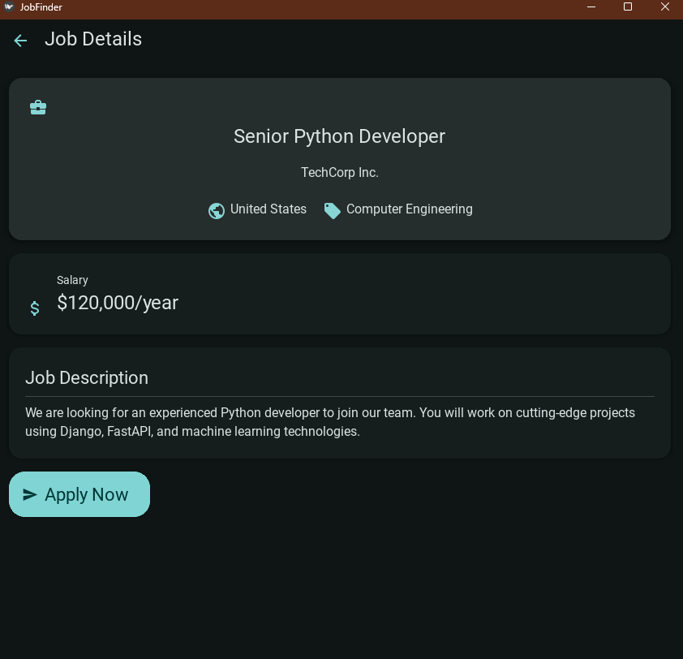
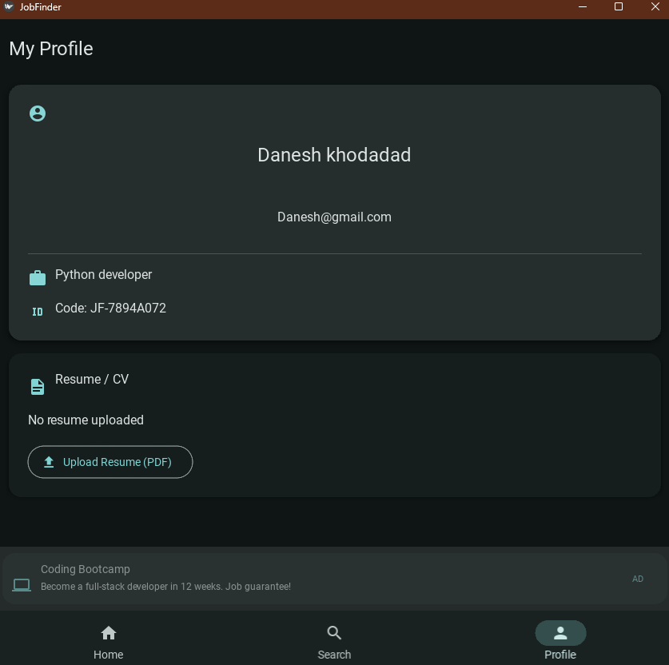
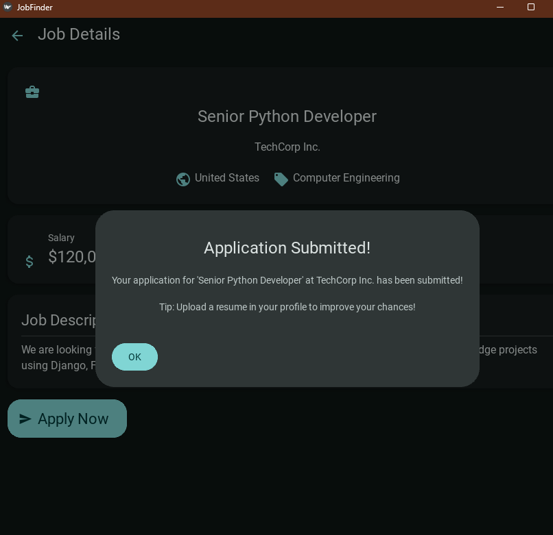

# 🚀 Job Finder — Your Career Companion

  

A polished, cross-platform job search app built with **Python 3.9+** and **KivyMD**. Designed for Android and Windows, Job Finder helps users discover, view, and apply to jobs from around the globe with a clean dark theme and intuitive interface.

## Features

- 🎨 **Modern Dark Theme** - Professional UI with Teal color palette
- 👤 **User Authentication** - Register and login with secure password hashing
- 🔍 **Job Search** - Search through 20+ job listings by keyword
- 📋 **Job Details** - View complete job information with salary and description
- 👨‍💼 **User Profile** - Manage your profile and upload resume
- 📢 **Advertisement System** - Weighted rotating ads at the bottom of screens
- 🌍 **Multiple Countries** - Jobs from USA, Canada, UK, Germany, and more

## Project Structure

```
JobFinder-Kivy/
├── main.py                   # Application entry point
├── requirements.txt          # Python dependencies
├── buildozer.spec            # Android build configuration
├── jobfinder.spec            # Windows build configuration
├── README.md                 # This file
│
├── database/                 # Database layer
│   ├── __init__.py
│   ├── db_manager.py         # SQLite database operations
│   └── models.py             # Data models (User, Job, Advertisement)
│
├── screens/                  # Application screens
│   ├── welcome_screen.py     # Welcome/landing screen
│   ├── login_screen.py       # User login
│   ├── register_screen.py    # User registration
│   ├── main_screen.py        # Main app with navigation
│   └── job_detail_screen.py  # Job details view
│
├── components/               # Reusable UI components
│   ├── ad_banner.py          # Advertisement banner
│   └── job_card.py           # Job listing card
│
├── utils/                    # Utility functions
│   └── helpers.py            # Helper functions
│
└── data/                     # Database storage (auto-created)
    └── jobfinder.db          # SQLite database
```

## Installation

### Prerequisites

- Python 3.9 or higher
- pip (Python package manager)

### Setup

1. **Clone or download the project**

2. **Create a virtual environment** (recommended):

   ```bash
   python -m venv venv

   # Windows
   venv\Scripts\activate

   # Linux/macOS
   source venv/bin/activate
   ```

3. **Install dependencies**:

   ```bash
   pip install -r requirements.txt
   ```

4. **Run the application**:
   ```bash
   python main.py
   ```

## Building for Distribution

### Building Windows Executable (EXE)

1. **Install PyInstaller and Kivy dependencies**:

   ```bash
   pip install pyinstaller
   pip install kivy[base] kivymd
   pip install pyinstaller-hooks-contrib
   ```

2. **Install Kivy dependencies for Windows**:

   ```bash
   pip install kivy_deps.sdl2 kivy_deps.glew
   ```

3. **Build the executable**:

   ```bash
   pyinstaller jobfinder.spec
   ```

4. **Find the executable** in `dist/JobFinder/JobFinder.exe`

#### Alternative: One-file executable

```bash
pyinstaller --onefile --windowed --name JobFinder main.py
```

### Building Android APK

#### Prerequisites

- Linux or WSL (Windows Subsystem for Linux)
- Java JDK 11
- Android SDK and NDK (auto-downloaded by buildozer)

#### Build Steps

1. **Install Buildozer**:

   ```bash
   pip install buildozer
   ```

2. **Install system dependencies** (Ubuntu/Debian):

   ```bash
   sudo apt-get update
   sudo apt-get install -y \
       python3-pip \
       build-essential \
       git \
       python3 \
       python3-dev \
       ffmpeg \
       libsdl2-dev \
       libsdl2-image-dev \
       libsdl2-mixer-dev \
       libsdl2-ttf-dev \
       libportmidi-dev \
       libswscale-dev \
       libavformat-dev \
       libavcodec-dev \
       zlib1g-dev \
       libgstreamer1.0 \
       gstreamer1.0-plugins-base \
       gstreamer1.0-plugins-good \
       libgstreamer-plugins-base1.0-dev \
       openjdk-11-jdk \
       unzip \
       zip \
       autoconf \
       automake \
       libtool \
       pkg-config \
       cmake
   ```

3. **Build the APK**:

   ```bash
   # Debug build
   buildozer android debug

   # Release build (requires signing key)
   buildozer android release
   ```

4. **Find the APK** in `bin/jobfinder-1.0.0-arm64-v8a-debug.apk`

5. **Deploy to connected device**:
   ```bash
   buildozer android deploy run
   ```

#### Using WSL on Windows

If using Windows, you can use WSL:

1. Install WSL2 with Ubuntu
2. Follow the Linux build steps above
3. Copy the APK from WSL to Windows:
   ```bash
   cp bin/*.apk /mnt/c/Users/YourUsername/Desktop/
   ```

## ✨ Highlights & Screenshots

### Welcome Screen



### Login / Sign‑up



### Create Account



### Main Dashboard



### Job Details



### Profile Page



### Apply Confirmation



## 🚀 Usage

1. **Register** – tap **Create Account**, fill in your details and specialty, then log in using your newly created credentials. A unique user code is generated automatically.
2. **Search Jobs** – switch to the search tab, filter by keyword, country or category, and browse the job cards.
3. **View Details** – click any job to see salary, description, and location. Tap **Apply Now** to submit your application. A friendly confirmation dialog will notify you.
4. **Manage Profile** – open the profile tab to view/edit your info, upload a resume (PDF), and copy your user code.
5. **Advertisements** – ads rotate every 10 seconds based on weighted payouts; tap an ad for more information.

## 🧠 Technical Details

- **Database:** SQLite with users, jobs, and advertisements tables. Preloaded with 22 jobs and 8 ads. Weighted random selection algorithm for ad rotation.
- **Security:** SHA-256 password hashing, email validation, and minimum password strength checks.
- **Theme:** Dark mode using Teal primary palette, powered by KivyMD Material Design 3 components. Smooth animations throughout.

## 🛠 Troubleshooting

- **App won't start:** ensure dependencies (`pip install -r requirements.txt`) and Python 3.9+.
- **Database issues:** delete `data/jobfinder.db` to reset.
- **Windows build errors:** install Visual C++ Build Tools or upgrade `kivy`, `kivymd`.
- **Android build errors:** use Linux/WSL, verify Java 11, and run `buildozer android clean`.

## 🙌 Credits

Built with:

- [Kivy](https://kivy.org/) — cross‑platform Python UI framework
- [KivyMD](https://kivymd.readthedocs.io/) — Material Design components for Kivy
- [Buildozer](https://buildozer.readthedocs.io/) — Android build system
- [PyInstaller](https://pyinstaller.org/) — packaging for Windows
